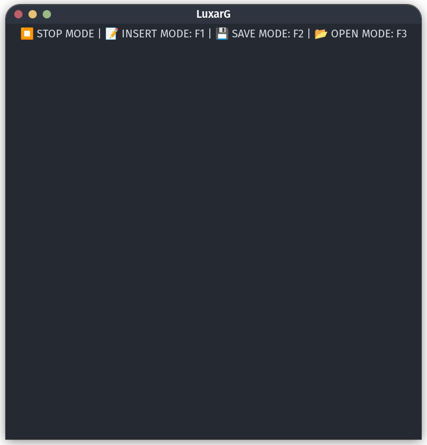

# luxarg :


LUXARG is a keyboard-friendly text editor.

This project started in August 2019 and was restarted in 2021.

Easy to use and user-friendly!

LUXARG supports:

- Fedora, CENTOS, and RedHat
- Debian and Ubuntu
- OpenSUSE
- Arch and Manjaro


# ICON


# Screenshot :




# KEYS : 
- INSERT MODE : <F1>
- SAVE MODE : <F2>
- OPEN MODE : <F3>


# INSTALLATION
Run the installer script:
```
$ python3 installer.py
```


# Notes
This is a simple pure Python and keyboard-friendly text editor solution.
