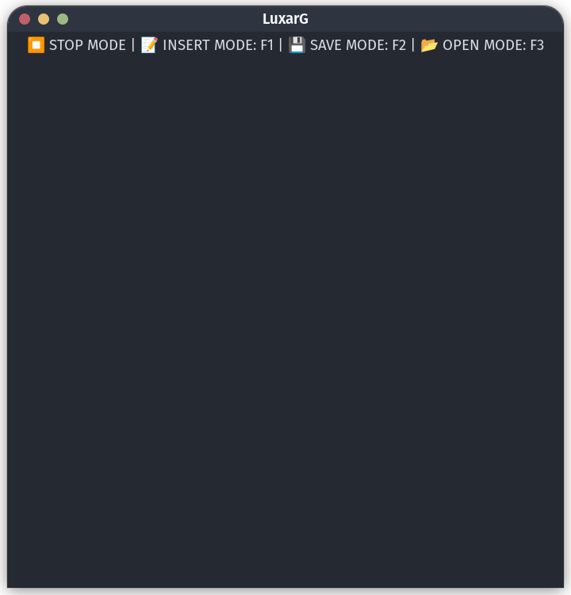

# luxarg :


LUXARG is another keyboard friendly text editor.

This project started at August 2019 and restarted at 2021 TODAY!

Easy to use and user-friendly !


# LUXARG support :
 
*WINDOWS10*

 
Fedora, 

CENTOS,

RedHat,

Debian,

Ubuntu, 

OpenSUSE, 

Arch,

Manjaro

# ICON


# screenshot :




# Licensing

AMZYEI (Amin Azimi) 

Copyright (C) (2019-2025)  AMZYEI (Amin Azimi) 

"Luxarg" (This program) is free software: you can redistribute it and/or modify
it under the terms of the GNU General Public License as published by
the Free Software Foundation, either version 3 of the License, or
(at your option) any later version.

This program is distributed in the hope that it will be useful,
but WITHOUT ANY WARRANTY; without even the implied warranty of
MERCHANTABILITY or FITNESS FOR A PARTICULAR PURPOSE.  See the
GNU General Public License for more details.

You should have received a copy of the GNU General Public License
along with this program.  If not, see <http://www.gnu.org/licenses/>.


# KEYS : 

    INSERT MODE : <F1>
    SAVE   MODE : <F2>
    OPEN   MODE : <F3>
    HELP   MODE : <F4>
    DELETE ALL  : <Ctrl + 0>
    SELECT ALL  : <Ctrl + />
    CORSUR RIGHT: <Ctrl + f> move the cursor forward one space.
    CORSUR LEFT : <Ctrl + b> move the cursor backward one space.
    Copy        : <Ctrl + c>
    Paste       : <Ctrl + v>
    Cut         : <Ctrl + w>
    UNDO        : <Ctrl + z>
    REDO        : <Ctrl + Shift + z>
    HELP   CLI  : luxarg <-h/--help>
    ZOOM IN     : <Ctrl + equal(=)>
    ZOOM OUT    : <Ctrl + minus(-)>

# Running On Windows 10:
  
    Simply run "LuxarG.exe" for using Luxarg portable OR install system WIDE BY running "Setup.exe"
    

# Running on Linux
    
```
    pip3 install -r requirements.txt
    python3 main.py
```
**for installing pip on Linux, PLEASE SEE THE pip.txt**
